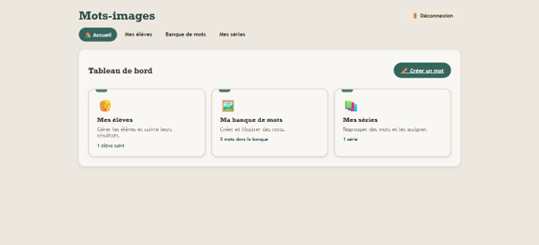
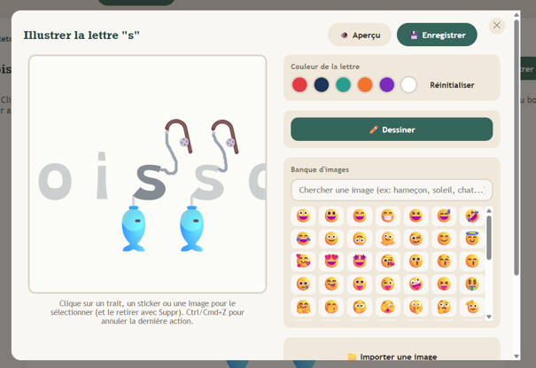
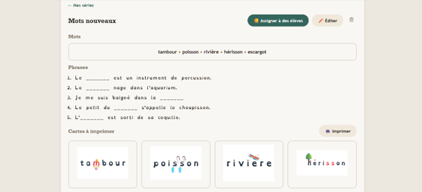
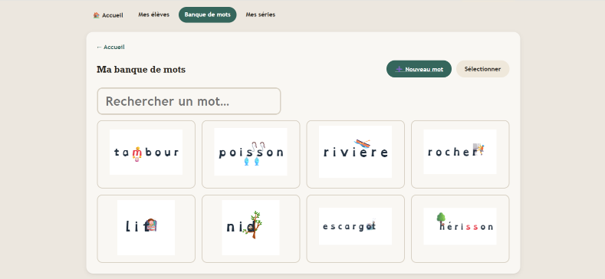
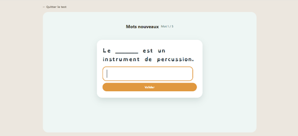
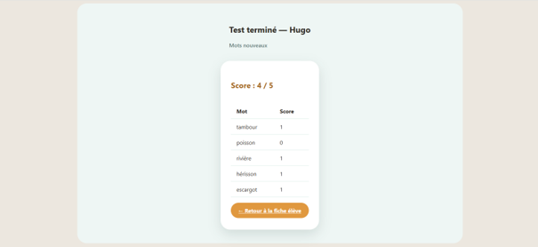
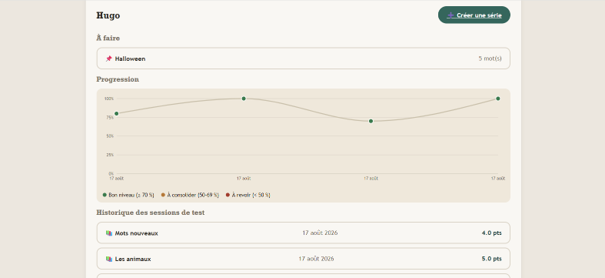

# Mots-images

A spelling memorization app for children with dysorthographia, based on the visual mnemonic method (word-images): pairing an illustration with the letter or group of letters that causes trouble in a word.

A teacher (or a parent) creates illustrated words, groups them into thematic series, assigns them to students, and tracks their progress through test sessions.



## Project structure

This repository contains two separate applications, communicating through a REST API:

- [`mots-images-api/`](./mots-images-api) — the backend (Node.js, Express, PostgreSQL)
- [`mots-images-app/`](./mots-images-app) — the frontend (React, Vite)

Each subfolder has its own README with detailed setup instructions and documentation.

## The backend: designed, modeled, and built from scratch

This is the part of the project I gave the most attention to, and it best reflects my work as a developer. A few things worth checking out in its full documentation:

- **A 10-table relational schema**, with several many-to-many relationships (a student can have multiple teachers, a word can belong to multiple series), soft deletes to preserve teaching history even after deletion, and a unique constraint preventing duplicate assignments.
- **Authorization checked systematically per resource**: every route doesn't just verify a user is logged in, it verifies the requested resource actually belongs to them — a teacher can never access another teacher's students, words, or series.
- **Real business logic, not a plain CRUD**: conditional score calculation based on attempt count, test result aggregation, JSONB handling for illustration data.

👉 **[Read the full backend documentation](./mots-images-api/README.md)** — database schema, full route list with inputs/outputs, architecture choices, known limitations.

## Preview

### Illustrating a word, letter by letter

Freehand drawing, stickers, imported images with cropping — each difficult letter or letter group gets its own mnemonic illustration.



### Composing and managing series

A series groups several words together, with fill-in-the-blank sentences, a reorderable sequence, and printable cards for offline practice.



### A reusable word bank



### Taking the test

Fill-in-the-blank sentence, two attempts, an illustrated hint shown after a second miss, a detailed word-by-word result.




### Tracking progress

A clear view of score evolution over time, for each student.



## Division of work

The **backend** — database modeling, REST API, authentication, authorization, business logic — was entirely designed and built by me, from scratch.

The **frontend** was generated by Claude Code, under my constant supervision: detailed scoping of every screen and flow, connecting it to the API I built, critical review of the output, successive iterations to fix functional bugs and refine the user experience. I didn't write the React code line by line, but I directed the whole product — from data architecture decisions down to the expected behavior of each interaction.

## Tech stack

**Backend**: Node.js, Express, PostgreSQL, JWT, bcrypt
**Frontend**: React, Vite, Konva (illustration canvas), react-router-dom, recharts (progress visualization)

## Quick start

See the [`mots-images-api`](./mots-images-api/README.md) and [`mots-images-app`](./mots-images-app/README.md) READMEs for detailed setup instructions. In short:

```bash
# Backend
cd mots-images-api
npm install
# configure .env (see backend README)
node index.js

# Frontend, in another terminal
cd mots-images-app
npm install
npm run dev
```
