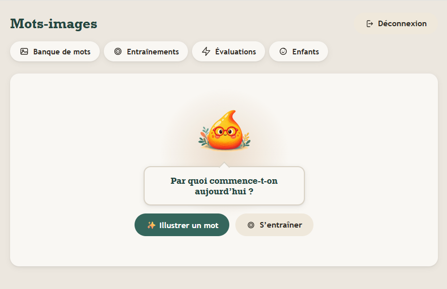
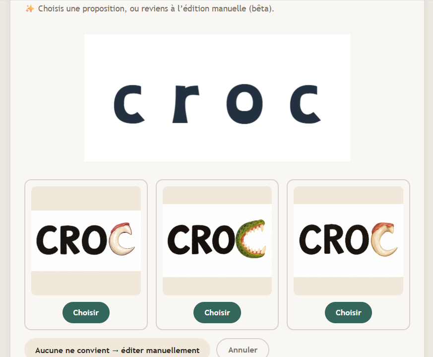
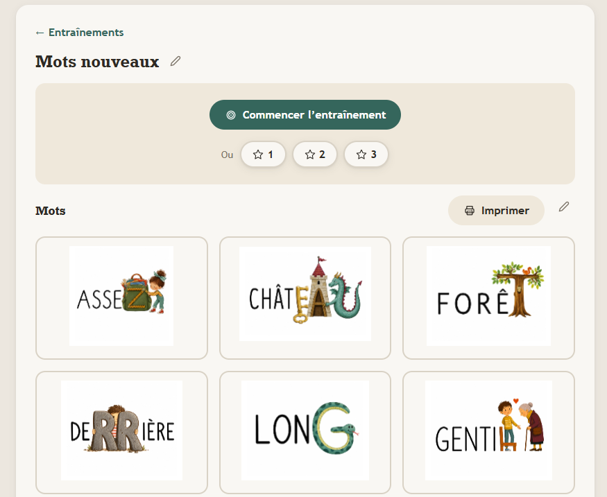
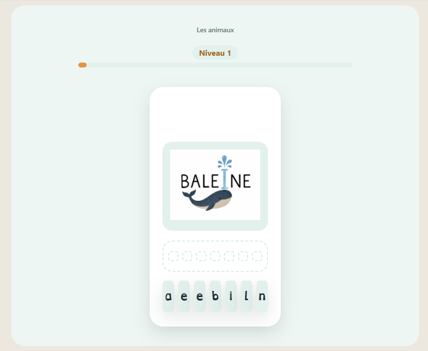

# Mots-images

A spelling memorization app for children with dysorthographia, based on the visual mnemonic method (word-images): pairing an illustration with the letter or group of letters that causes trouble in a word. Illustrating a word is primarily automatic — a parent or teacher picks the letters to work on and an AI model generates the illustration — with manual drawing available as a fallback for the cases the model can't handle well.

A parent (or teacher) builds up a personal bank of illustrated words this way, can share any of them into a common bank — a collaborative illustrated dictionary available to every user — and composes them into training series. Each series can be practiced through three progressive difficulty levels before being taken as a graded evaluation, with results and a per-word score history tracked over time for each child.



## Project structure

This repository contains two separate applications, communicating through a REST API:

- [`mots-images-api/`](./mots-images-api) — the backend (Node.js, Express, PostgreSQL)
- [`mots-images-app/`](./mots-images-app) — the frontend (React, Vite)

Each subfolder has its own README with detailed setup instructions and documentation.

## The backend: designed, modeled, and built from scratch

This is the part of the project I gave the most attention to, and it best reflects my work as a developer. A few things worth checking out in its full documentation:

- **A 10-table relational schema**, with several many-to-many relationships (a student can have multiple teachers, a word can belong to multiple series), soft deletes to preserve teaching history even after deletion, and application-level duplicate-assignment prevention.
- **Authorization checked systematically per resource**: every route doesn't just verify a user is logged in, it verifies the requested resource actually belongs to them — a teacher can never access another teacher's students, words, or series.
- **Real business logic, not a plain CRUD**: a two-step OpenAI pipeline for AI-assisted illustration generation (rate-limited per teacher), a private/pending/common moderation workflow for a shared word bank, test result aggregation, JSONB handling for illustration data.

👉 **[Read the full backend documentation](./mots-images-api/README.md)** — database schema, full route list with inputs/outputs, architecture choices, known limitations.

## Preview

### Illustrating a word, letter by letter

Pick the letter or letter group that's giving trouble, and an AI model generates the mnemonic illustration — this is the default way words get illustrated. When the model doesn't produce a usable result, the same editor falls back to manual tools: freehand drawing, stickers, imported images with cropping.



### Composing and managing training series

A series is built from previously illustrated words (from the personal or common bank), with fill-in-the-blank sentences, a reorderable sequence, and printable cards for offline practice.



### A personal and shared word bank

Words illustrated this way are kept in a personal bank, and can be submitted to a common bank shared across every user — a collaborative illustrated dictionary anyone can browse and reuse.

### Practicing before the evaluation

Before taking the graded evaluation, a child can practice a training's words through three progressive levels, done in sequence or picked individually: reconstructing the illustrated word from shuffled letter tiles, then reordering tiles for the same word heard but not shown (so only the order can be wrong, never the letters), then writing it from memory on the keyboard after hearing it once. This practice is free and never graded.



### Taking the evaluation

Fill-in-the-blank sentence, two attempts, an illustrated hint shown after a second miss, a detailed word-by-word result.

### Tracking progress

A clear view of score evolution over time for each child, down to a per-word score breakdown for any past evaluation.


**Also included, not pictured here:** an admin role that moderates submissions to the common word bank.

## Division of work

The **backend** — database modeling, REST API, authentication, authorization, business logic — was entirely designed and built by me, from scratch.

The **frontend** was generated by Claude Code, under my constant supervision: detailed scoping of every screen and flow, connecting it to the API I built, critical review of the output, successive iterations to fix functional bugs and refine the user experience. I didn't write the React code line by line, but I directed the whole product — from data architecture decisions down to the expected behavior of each interaction.

## Where this could go next

AI-generated illustration (currently *beta*, rate-limited per teacher) is already the default way a word gets illustrated: a parent or teacher enters a word and the specific letters to memorize, and a two-step pipeline generates a concept, then renders it as 3 image variations to pick from — see [`POST /words/:wordId/generate-illustration`](./mots-images-api/README.md) for the full pipeline. The manual editor only comes in as a fallback, for the words the model fails to illustrate well. Two steps of the original idea for this pipeline aren't built yet, which is why the final judgment call is still made by hand, by picking among the 3 proposals:

- **Quality control** — automatically evaluate and rank the generated concepts against explicit criteria (semantic relevance, natural letter integration, word readability, likely memorability for a child, absence of artificially invented details), instead of leaving that judgment entirely to the parent or teacher.
- **Verification** — automatically check the generated image against the original word, letter positions, and pedagogical intent before presenting it, to catch bad generations before they reach the picker.

Closing this gap would turn illustration from "pick the best of 3" into a guided creative direction task where the parent or teacher expresses intent and the pipeline does more of its own quality assurance — reducing how often the manual fallback is needed at all.

## Tech stack

**Backend**: Node.js, Express, PostgreSQL, JWT, bcrypt, OpenAI (illustration generation)
**Frontend**: React, Vite, Konva (illustration canvas), react-router-dom, recharts (progress visualization)

## Live demo

- Frontend: [mots-images.vercel.app](https://mots-images.vercel.app)
- Backend API: [mots-images-production.up.railway.app](https://mots-images-production.up.railway.app)

Deployed on Railway (backend + PostgreSQL) and Vercel (frontend).

## Quick start

See the [`mots-images-api`](./mots-images-api/README.md) and [`mots-images-app`](./mots-images-app/README.md) READMEs for detailed setup instructions. In short:

```bash
# Backend
cd mots-images-api
npm install
# configure .env (see backend README)
node index.js

# Frontend, in another terminal
cd mots-images-app
npm install
npm run dev
```
