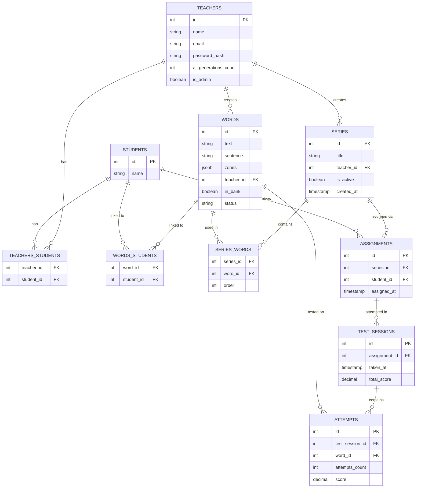

# mots-images-api

Backend API for the Mots-Images project — a spelling memorization app for children with dysorthographia, based on the visual mnemonic method (word-images).

A teacher creates illustrated words (personal bank or dedicated to a specific student), groups them into series, assigns them to students, and tracks their progress through test sessions.

## Tech stack

- Node.js / Express
- PostgreSQL (via `pg`)
- JWT authentication (`jsonwebtoken`)
- Password hashing (`bcrypt`)

## Setup

```bash
npm install
```

Create a `.env` file at the project root:

```
POSTGRES_HOST=localhost
POSTGRES_DB=mots_images_db
POSTGRES_USER=your_user
POSTGRES_PASSWORD=your_password
POSTGRES_PORT=5432
JWT_SECRET=your_secret_key
OPENAI_API_KEY=your_openai_api_key
```

Run the server:

```bash
node index.js
```

The API runs on `http://localhost:3000`.

## Authentication

All routes except `POST /teachers/register` and `POST /teachers/login` require a JWT token.

After a successful login, include the token in every subsequent request:

```
Authorization: Bearer <token>
```

Tokens expire after 24h.

## Authorization

Every route that targets a specific resource (a word, a series, an assignment, a test session) verifies that the resource actually belongs to the authenticated teacher, not just that the teacher is logged in. A teacher who requests a resource that isn't theirs receives a `403 Forbidden`. Some routes additionally require the authenticated teacher to be an admin (`is_admin = true` on their account). These are marked *(admin only)* in the route documentation below and return `403 Forbidden` for non-admin teachers.

## Database schema



## Routes

### Teachers

**POST /teachers/register**
Creates a new teacher account.
Body: `{ name: string, email: string, password: string }`
Returns (201): `{ id, name, email }`
Returns (400) if the password is shorter than 8 characters.

**POST /teachers/login**
Authenticates a teacher and returns a JWT.
Body: `{ email: string, password: string }`
Returns (200): `{ message, token, isAdmin }`
Returns (401) with a generic message if the email doesn't exist or the password is wrong (no distinction, to avoid leaking which emails are registered).

### Students

**GET /students/myStudents**
Returns all students linked to the authenticated teacher.
Returns (200): `[{ id, name }, ...]`

**POST /students**
Creates a student and automatically links it to the authenticated teacher.
Body: `{ name: string }`
Returns (201): `{ id, name }`

**GET /students/:studentId/test-sessions**
Returns the test session history for a specific student — series title, date, and total score for each completed session.
Returns (200): `[{ id, title, series_id, taken_at, total_score }, ...]`
Returns (403) if the student doesn't belong to the authenticated teacher.

### Words

**POST /words**
Creates a word in the teacher's bank. `zones` starts empty (`[]`) — illustration is added afterward.
Body: `{ text: string, sentence: string }`
Returns (201): `{ id, text, sentence, zones, teacher_id }`

**GET /words**
Returns all words belonging to the authenticated teacher. By default, only words the teacher owns are returned.
Query params: `includeCommonWords` (optional, boolean) — when set to `true`, also includes words shared by other teachers (`status = 'common'`), in addition to the teacher's own words.
Returns (200): `[{ id, text, sentence, zones, status }, ...]`

**POST /words/:wordId/students**
~~Links a word to one or more students (for words dedicated to specific children rather than kept in the general bank).~~
In V1, this allowed a teacher to keep several differently-illustrated versions of the same word, each targeting a specific letter group needed by a specific child (e.g. for "chien", one version illustrating "CH", another illustrating "EN", each assigned to the child who needed that particular letter combination memorized).
This mechanism is deprecated in V2: the underlying `words_students` table was written to but never read by any training or test-session logic — no feature ever consumed this link. V2's intended approach for per-child targeting is different and not yet implemented. The controller and model function are commented out in the codebase.
Body: `{ studentIds: number[] }`
Returns (201): `[{ student_id, word_id }, ...]`
Returns (403) if the word doesn't belong to the authenticated teacher and isn't part of the common bank (status = 'common')

**PUT /words/:wordId**
Updates a word's `sentence` and/or `zones` (used to persist illustration changes after the word has been created).
Body: `{ sentence: string, zones: array }`
Returns (200): `{ id, text, sentence, zones }`
Returns (403) if the word doesn't belong to the authenticated teacher.
Returns (404) if no word matches (defensive check, in addition to the 403 check).

**PUT /words/:wordId/status**
Removes a word from the teacher's active bank (soft delete: sets `in_bank` to `false`). The word remains fully intact and visible in any series that already references it — only its visibility in GET /words is affected. If the word's status is common, it remains visible to other teachers via the common bank
No body required.
Returns (200): `{ id, in_bank }`
Returns (404) if no matching word is found for this teacher.

**POST /words/:wordId/generate-illustration** *(beta)*
Generates 3 AI illustration proposals for a word, targeting a specific letter or consecutive group of letters. Uses a two-step pipeline: OpenAI's Responses API first generates a text concept for the illustration, which is then injected into the prompt sent to OpenAI's image generation API (`gpt-image-2`) to produce 3 variations. Images are returned as base64-encoded strings — nothing is persisted until the teacher selects one (see PUT /words/:wordId to save the final choice). Each teacher has a limited number of generations (`ai_generations_count` on the `teachers` table).
Body: `{ letters: string, positions: number[] }` — `positions` must be an array of consecutive 1-based indices matching the target letter(s) in the word.
Returns (200): `{ illustrations: [{ id, image }, ...] }`
Returns (400) if `positions` is empty or contains non-consecutive indices.
Returns (403) if the word doesn't belong to the authenticated teacher.
Returns (429) if the teacher has reached their generation quota.
Returns (500) if the OpenAI API call (text or image step) fails.

## Word status system

Each word has a `status` column with three possible values:
- `private` (default): visible only to its owner.
- `pending`: submitted by its owner for inclusion in the common word bank, awaiting admin review.
- `common`: approved by an admin, visible to all teachers via `GET /words?includeCommonWords=true`. The word's `teacher_id` never changes upon approval — it always reflects the original creator, who retains full ownership and visibility of the word regardless of its status.

**PUT /words/:wordId/status/pending**
Submits a word for admission into the common word bank. Sets the word's `status` to `pending`, awaiting admin review. Only the word's owner can submit it.
No body required.
Returns (200): `{ id, status }`
Returns (403) if the word doesn't belong to the authenticated teacher.

**PUT /words/:wordId/status/common** *(admin only)*
Approves a pending word, making it visible to all teachers via the common word bank. Sets `status` to `common`. Does not require ownership of the word — any word can be approved by an admin.
No body required.
Returns (200): `{ id, status }`
Returns (403) if the authenticated teacher is not an admin.
Returns (404) if no matching word is found.

**PUT /words/:wordId/status/private**
*(admin only)* Rejects a pending word, reverting it back to private status (visible only to its original owner). Sets `status` to `private`.
No body required.
Returns (200): `{ id, status }`
Returns (403) if the authenticated teacher is not an admin.
Returns (404) if no matching word is found.

**GET /words/status/pending** *(admin only)*
Returns all words currently awaiting admin review, regardless of which teacher submitted them.
Returns (200): `[{ id, text, sentence, zones, teacher_id }, ...]`
Returns (403) if the authenticated teacher is not an admin.

### Series

**POST /series**
Creates an empty series (just a title). Words are added afterward.
Body: `{ title: string }`
Returns (201): `{ id, title }`

**POST /series/:seriesId/words**
Links existing words to a series, preserving the order they're given in.
Body: `{ wordsIds: number[] }`
Returns (201): `[{ series_id, word_id, order }, ...]`
Returns (403) if the series doesn't belong to the authenticated teacher , or if any of the given words don't belong to the authenticated teacher and aren't part of the common bank (status = 'common').

**GET /series/:seriesId**
Returns the full detail of a series — title, and for each linked word: text, sentence, and order.
Returns (200): `[{ id, text, sentence, zones, order, title }, ...]`
Returns (404) if no matching series is found.

**GET /series**
Returns all series belonging to the authenticated teacher, with a word count for each (series with no words yet still appear, with `count: 0`).
Returns (200): `[{ id, title, count, created_at }, ...]`

**PUT /series/:seriesId**
Updates a series title.
Body: `{ title: string }`
Returns (200): `{ id, title }`
Returns (403) if the series doesn't belong to the authenticated teacher.

**PUT /series/:seriesId/status**
Soft-deletes a series (sets `is_active` to `false`). The series no longer appears in GET /series, but its history (assignments, test sessions, scores) remains intact and queryable.
No body required.
Returns (200): `{ id, is_active }`
Returns (403) if the series doesn't belong to the authenticated teacher.

**DELETE /series/:seriesId/words/:wordId**
Removes a word from a series (only the link, the word itself and its illustration remain untouched).
Returns (200): `{ word_id, series_id }`
Returns (404) if no matching series is found for this teacher.

**PUT /series/:seriesId/words/order**
Updates the display order of words within a series.
Body: `{ wordsDetails: [{ wordId: number, newOrder: number }, ...] }`
Returns (200): `[{ word_id, order }, ...]`
Returns (404) if no matching series is found for this teacher.

### Assignments

**POST /assignments/:seriesId/students**
Assigns a series to one or more students. Creates one row per student (an assignment is always tied to exactly one student). Students already assigned to this series are silently skipped.
Body: `{ studentsIds: number[] }`
Returns (201): `[{ id, series_id, student_id }, ...]`
Returns (403) if the series doesn't belong to the authenticated teacher, or if any of the given students don't.
Returns (409) if all given students are already assigned to this series.

**GET /assignments/:studentId**
Returns the assignments given to a specific student that don't have a completed test session yet ("pending" assignments) — series title and word count for each.
Returns (200): `[{ id, series_id, title, count }, ...]`
Returns (403) if the student doesn't belong to the authenticated teacher.

**GET /assignments/all/:studentId**
Returns all active assignments given to a specific student, regardless of whether they have a completed test session (unlike GET /assignments/:studentId which only returns pending ones). Only assignments linked to active series (`is_active = true`) are included.
Returns (200): `[{ id, series_id, title, count }, ...]`
Returns (403) if the student doesn't belong to the authenticated teacher.

### Test sessions

**POST /test-sessions/:assignmentId**
Records the result of a completed test session. The attempt/score logic per word (1 point if solved on the first try, 0.5 on the second, 0 if the image had to be shown) is computed on the frontend — the backend only stores the final result.

⚠️ The frontend must send `score` as a real number (`1`, `0.5`, `0`), not a string — the backend sums these values directly to compute `total_score`.

Body:
```json
{
  "attempts": [
    { "wordId": 3, "attemptsCount": 1, "score": 1 },
    { "wordId": 7, "attemptsCount": 2, "score": 0.5 }
  ]
}
```
Returns (201):
```json
{
  "totalScore": { "id": 14, "assignment_id": 3, "total_score": "1.5" },
  "scoreByAttempt": [
    { "id": 27, "test_session_id": 14, "word_id": 3, "attempts_count": 1, "score": "1" },
    { "id": 28, "test_session_id": 14, "word_id": 7, "attempts_count": 2, "score": "0.5" }
  ]
}
```
Returns (403) if the assignment doesn't belong to the authenticated teacher.

**GET /test-sessions/:testSessionId/words**
Returns the per-word detail of one specific test session — which words were tested and the score obtained on each.
Returns (200): `[{ text, score }, ...]`
Returns (403) if the session doesn't belong to the authenticated teacher.

## Known limitations (V1) and possible next steps

- **One sentence per word.** Each word has a single fill-in-the-blank sentence, so a word reused across several series/tests always shows the same sentence. A V2 could support several sentences per word (a separate `sentences` table, or multiple columns) with random selection at test time.
- **No API documentation tool.** Routes are documented here and in a Postman collection. A future improvement would be to generate interactive docs with Swagger/OpenAPI.
- **`DECIMAL` columns return strings.** PostgreSQL returns `total_score` and `score` as strings (e.g. `"1.5"`), not numbers. Convert with `Number(...)` before doing further math on them if needed.
- **One test session per assignment (V1).** The application flow doesn't currently allow re-assigning a series to a student who's already been assigned it, so only one test session per (series, student) pair is possible. This is enforced at the application level (`assignStudentsToSeriesController`), not by a database constraint alone. A V2 could allow multiple sessions per assignment (the `test_sessions` table already supports this structurally) if repeated evaluation becomes a need.
- **Per-child word targeting (deprecated mechanism).** V1 included a `words_students` link table and a `POST /words/:wordId/students` route intended to let a teacher assign differently-illustrated versions of the same word to different children based on their specific letter-group needs. This was never connected to any training/test logic and is now commented out. V2 should design a proper mechanism for this need if it remains a priority.
