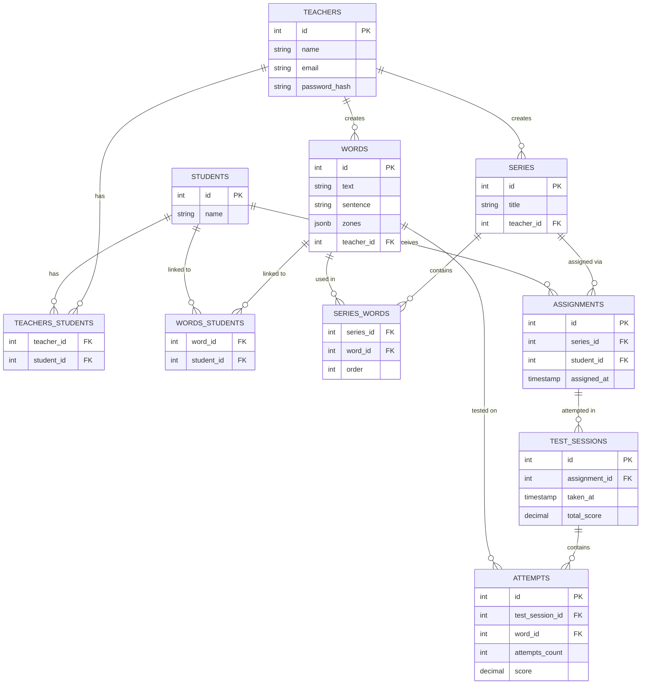

# mots-images-api

Backend API for the Mots-Images project — a spelling memorization app for children with dysorthographia, based on the visual mnemonic method (word-images).

A teacher creates illustrated words (personal bank or dedicated to a specific student), groups them into series, assigns them to students, and tracks their progress through test sessions.

## Tech stack

- Node.js / Express
- PostgreSQL (via `pg`)
- JWT authentication (`jsonwebtoken`)
- Password hashing (`bcrypt`)

## Setup

```bash
npm install
```

Create a `.env` file at the project root:

```
POSTGRES_HOST=localhost
POSTGRES_DB=mots_images_db
POSTGRES_USER=your_user
POSTGRES_PASSWORD=your_password
POSTGRES_PORT=5432
JWT_SECRET=your_secret_key
```

Run the server:

```bash
node index.js
```

The API runs on `http://localhost:3000`.

## Authentication

All routes except `POST /teachers/register` and `POST /teachers/login` require a JWT token.

After a successful login, include the token in every subsequent request:

```
Authorization: Bearer <token>
```

Tokens expire after 24h.

## Authorization

Every route that targets a specific resource (a word, a series, an assignment, a test session) verifies that the resource actually belongs to the authenticated teacher, not just that the teacher is logged in. A teacher who requests a resource that isn't theirs receives a `403 Forbidden`.

## Database schema



## Routes

### Teachers

**POST /teachers/register**
Creates a new teacher account.
Body: `{ name: string, email: string, password: string }`
Returns (201): `{ id, name, email }`

**POST /teachers/login**
Authenticates a teacher and returns a JWT.
Body: `{ email: string, password: string }`
Returns (200): `{ message, token }`
Returns (401) with a generic message if the email doesn't exist or the password is wrong (no distinction, to avoid leaking which emails are registered).

### Students

**GET /students/myStudents**
Returns all students linked to the authenticated teacher.
Returns (200): `[{ id, name }, ...]`

**POST /students**
Creates a student and automatically links it to the authenticated teacher.
Body: `{ name: string }`
Returns (201): `{ id, name }`

**GET /students/:studentId/test-sessions**
Returns the test session history for a specific student — series title, date, and total score for each completed session.
Returns (200): `[{ id, title, series_id, taken_at, total_score }, ...]`
Returns (403) if the student doesn't belong to the authenticated teacher.

### Words

**POST /words**
Creates a word in the teacher's bank. `zones` starts empty (`[]`) — illustration is added afterward.
Body: `{ text: string, sentence: string }`
Returns (201): `{ id, text, sentence, zones, teacher_id }`

**GET /words**
Returns all words belonging to the authenticated teacher.
Returns (200): `[{ id, text, sentence, zones }, ...]`

**POST /words/:wordId/students**
Links a word to one or more students (for words dedicated to specific children rather than kept in the general bank).
Body: `{ studentIds: number[] }`
Returns (201): `[{ student_id, word_id }, ...]`
Returns (403) if the word doesn't belong to the authenticated teacher.

**PUT /words/:wordId**
Updates a word's `sentence` and/or `zones` (used to persist illustration changes after the word has been created).
Body: `{ sentence: string, zones: array }`
Returns (200): `{ id, text, sentence, zones }`
Returns (403) if the word doesn't belong to the authenticated teacher.
Returns (404) if no word matches (defensive check, in addition to the 403 check).

### Series

**POST /series**
Creates an empty series (just a title). Words are added afterward.
Body: `{ title: string }`
Returns (201): `{ id, title }`

**POST /series/:seriesId/words**
Links existing words to a series, preserving the order they're given in.
Body: `{ wordsIds: number[] }`
Returns (201): `[{ series_id, word_id, order }, ...]`
Returns (403) if the series doesn't belong to the authenticated teacher.

**GET /series/:seriesId**
Returns the full detail of a series — title, and for each linked word: text, sentence, and order.
Returns (200): `[{ id, text, sentence, zones, order, title }, ...]`
Returns (404) if no matching series is found.

**GET /series**
Returns all series belonging to the authenticated teacher, with a word count for each (series with no words yet still appear, with `count: 0`).
Returns (200): `[{ id, title, count }, ...]`

### Assignments

**POST /assignments/:seriesId/students**
Assigns a series to one or more students. Creates one row per student (an assignment is always tied to exactly one student).
Body: `{ studentsIds: number[] }`
Returns (201): `[{ id, series_id, student_id }, ...]`
Returns (403) if the series doesn't belong to the authenticated teacher, or if any of the given students don't.

**GET /assignments/:studentId**
Returns the assignments given to a specific student that don't have a completed test session yet ("pending" assignments) — series title and word count for each.
Returns (200): `[{ id, series_id, title, count }, ...]`
Returns (403) if the student doesn't belong to the authenticated teacher.

### Test sessions

**POST /test-sessions/:assignmentId**
Records the result of a completed test session. The attempt/score logic per word (1 point if solved on the first try, 0.5 on the second, 0 if the image had to be shown) is computed on the frontend — the backend only stores the final result.

⚠️ The frontend must send `score` as a real number (`1`, `0.5`, `0`), not a string — the backend sums these values directly to compute `total_score`.

Body:
```json
{
  "attempts": [
    { "wordId": 3, "attemptsCount": 1, "score": 1 },
    { "wordId": 7, "attemptsCount": 2, "score": 0.5 }
  ]
}
```
Returns (201):
```json
{
  "totalScore": { "id": 14, "assignment_id": 3, "total_score": "1.5" },
  "scoreByAttempt": [
    { "id": 27, "test_session_id": 14, "word_id": 3, "attempts_count": 1, "score": "1" },
    { "id": 28, "test_session_id": 14, "word_id": 7, "attempts_count": 2, "score": "0.5" }
  ]
}
```
Returns (403) if the assignment doesn't belong to the authenticated teacher.

**GET /test-sessions/:testSessionId/words**
Returns the per-word detail of one specific test session — which words were tested and the score obtained on each.
Returns (200): `[{ text, score }, ...]`
Returns (403) if the session doesn't belong to the authenticated teacher.

## Known limitations (V1) and possible next steps

- **One sentence per word.** Each word has a single fill-in-the-blank sentence, so a word reused across several series/tests always shows the same sentence. A V2 could support several sentences per word (a separate `sentences` table, or multiple columns) with random selection at test time.
- **No API documentation tool.** Routes are documented here and in a Postman collection. A future improvement would be to generate interactive docs with Swagger/OpenAPI.
- **`DECIMAL` columns return strings.** PostgreSQL returns `total_score` and `score` as strings (e.g. `"1.5"`), not numbers. Convert with `Number(...)` before doing further math on them if needed.
